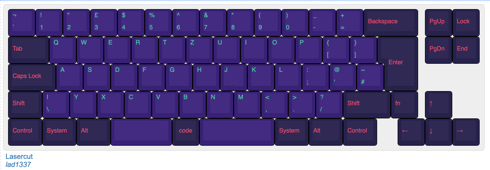
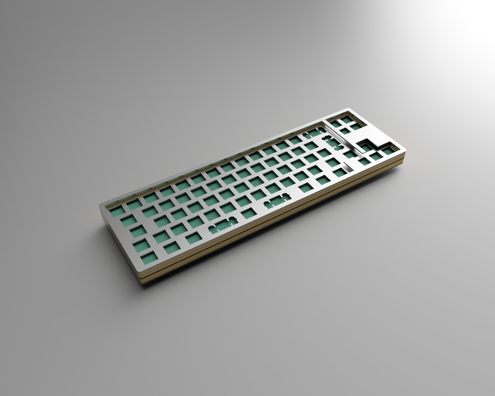
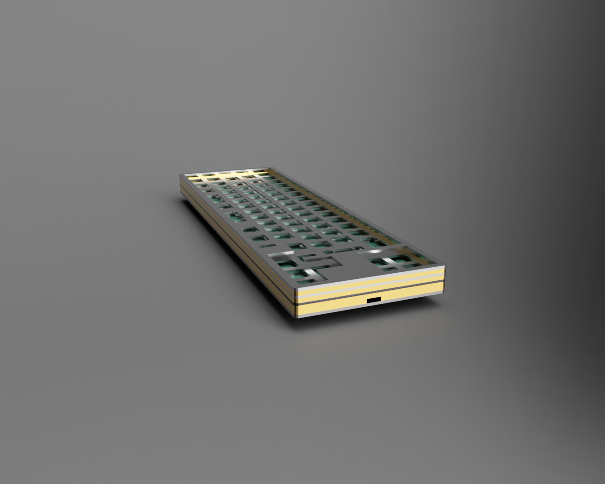

# Lasercut

PCB and case for an "iso" 72 key mechanical keyboard

## Layout

http://www.keyboard-layout-editor.com/#/gists/ba62eb48125304c6f380ac636846d038

## Case

The case is a sandwich style.
The plates can be rendered at http://builder.swillkb.com/
which is based on https://github.com/swill/kad.

in the case folder you will find a small go app(source) that can achive the same.

prerequisite:
    
    brew install inkscape pstoedit

render:

    cd case
    go run main.go

This will render svg, eps and dxf files

Example render in fusion with stainless steel and brass

## PCB

has to be redone for split space and new case
