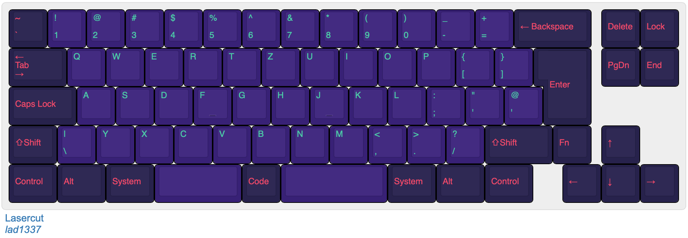

# Lasercut

PCB and case for an "iso" 72 key mechanical keyboard

## Layout



http://www.keyboard-layout-editor.com/#/gists/ba62eb48125304c6f380ac636846d038

## Case

The case is a sandwich style.
The plates can be rendered at http://builder.swillkb.com/
which is based on https://github.com/swill/kad.

in the case folder you will find a small go app(source) that can achive the same.

prerequisite:
    
    brew install inkscape pstoedit

render:

    cd case
    go run main.go

This will render svg, eps and dxf files.
These can be used with any CAD software.

You will need the following plates:

- 1x switch plate in 1.5mm
- 1x closed with magnets inserts in 3mm (not automatically rendered!!)
- 2x closed in 3mm
- 1x switch in 1.5mm
- 1x open in 3mm
- 1x bottom in 1-3mm


Example render in fusion with stainless steel and brass


## PCB


### Board edge

add the generated `./case/Lasercut_bottom.dxf` to the board and position:

    x: 23.0
    y: 19.94769

TODO: mounting holes

### Netlist

prerequisite: 

- `kle2netlist` installed, see https://github.com/lad1337/kle2netlist
    this will create a netlist from the kle json
- `kicad-kbplacer` kicad plugin installed, see https://github.com/lad1337/kicad-kbplacer
    this is a plugin that will place the swiches to the right place as well as create some tracks
- `node` and `npm install @ijprest/kle-serial --save` 
    this is needed for converting the kle json to its internal format


Steps:

- run:
    `make netlist`
- import the netlist into pcbnew
- run the kicad-kbplacer plugin
- rearrage the controller

    ```
    x: 335.4
    y: 72.6
    roation: 180
    ```
- finish all the other tracks
