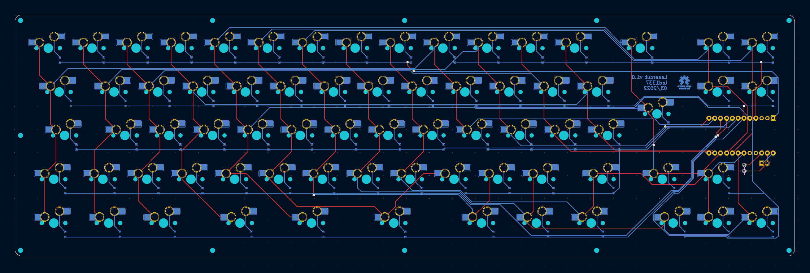
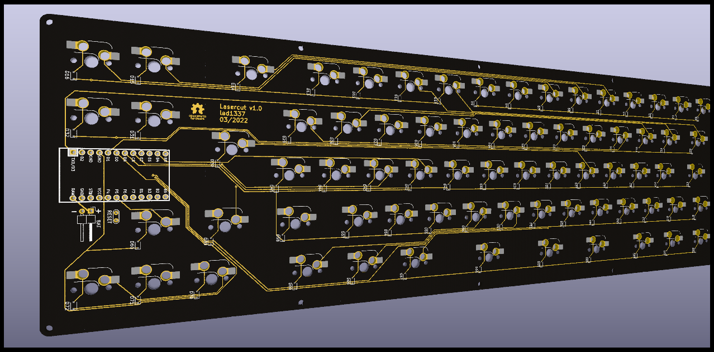

# Lasercut

PCB and case for an "iso" 72 key mechanical keyboard

## Layout

http://www.keyboard-layout-editor.com/#/gists/ba62eb48125304c6f380ac636846d038

## Case

The case is a sandwich style.
The plates can be rendered at http://builder.swillkb.com/
which is based on https://github.com/swill/kad.

in the case folder you will find a small go app(source) that can achive the same.

prerequisite:
    
    brew install inkscape pstoedit

render:

    cd case
    go run main.go

This will render svg, eps and dxf files.
These can be used with any CAD software.

You will need the following plates:

- 1x switch plate in 1.5mm
- 1x closed with magnets inserts in 3mm (not automatically rendered!!)
- 2x closed in 3mm
- 1x switch in 1.5mm
- 1x open in 3mm
- 1x bottom in 1-3mm

Example render in fusion with stainless steel and brass

## PCB

### Schematic

i forgot which tool i used to generate a the matrix

### PCB

* convert the KLE json with https://adamws.github.io/kle-serial/ [src](https://github.com/ijprest/kle-serial)
* using the [keylayout plugin](https://github.com/adamws/kicad-kbplacer)
* then [freerouting](https://github.com/freerouting/freerouting)
    
    /usr/local/opt/openjdk@11/bin/java -jar ~/Downloads/freerouting-1.5.0.jar -de ~/workspace/lasercut/pcb/lasercut.dsn -us global -is prioritized
